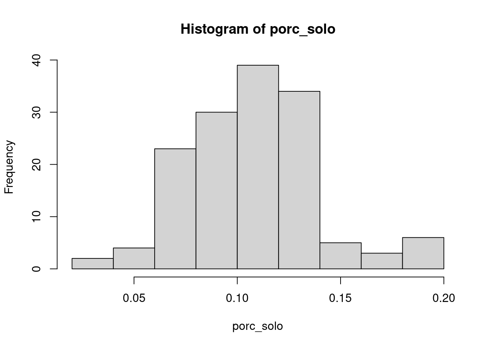
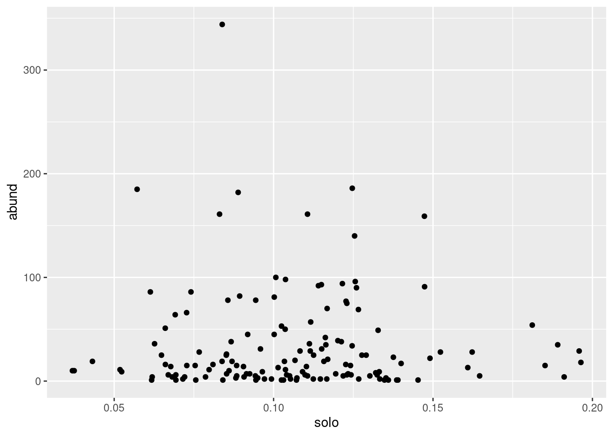
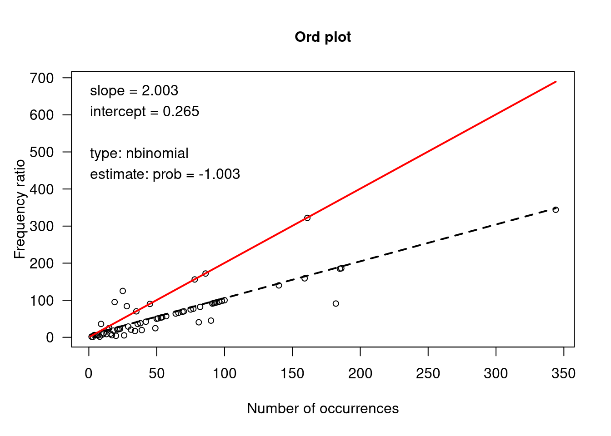
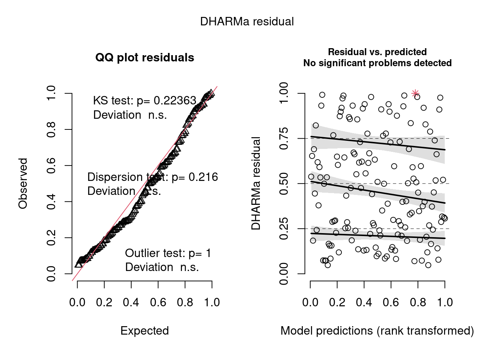

# Cap. 8 - Modelos Lineares Generalizados  {-}


```r
# Pacotes necessários
library(tidyverse)
library(ordinal)
library(naniar)
library(generalhoslem)
library(ecolottery)
library(DHARMa)
library(parameters)
library(piecewiseSEM)
library(vcd)
library(effectsize)
```

**8.1** 
Baixe [estes dados](https://www.stat.berkeley.edu/~statlabs/labs.html#video) que foram coletados numa pesquisa de opinião sobre uso de vídeo games por 91 estudantes de graduação no outono de 1994. Utilizando estes dados, constra um modelo: 1) Predizer a frequência com que uma pessoa joga vídeo game em função da idade; 2) Predizer a nota do estudante em função do tempo que jogou na semana antes da entrevista. Dica: esses são dados ordinais!

Solução:


```r
#---Importando os dados

videogame <- read.table("https://www.stat.berkeley.edu/~statlabs/data/video.data", h=TRUE, na.strings = "99")
head(videogame)
#>   time like where freq busy educ sex age home math work own
#> 1  2.0    3     3    2    0    1   0  19    1    0   10   1
#> 2  0.0    3     3    3    0    0   0  18    1    1    0   1
#> 3  0.0    3     1    3    0    0   1  19    1    0    0   1
#> 4  0.5    3     3    3    0    1   0  19    1    0    0   1
#> 5  0.0    3     3    4    0    1   0  19    1    1    0   0
#> 6  0.0    3     2    4    0    0   1  19    0    0   12   0
#>   cdrom email grade
#> 1     0     1     4
#> 2     1     1     2
#> 3     0     1     3
#> 4     0     1     3
#> 5     0     1     3
#> 6     0     0     3
str(videogame)
#> 'data.frame':	91 obs. of  15 variables:
#>  $ time : num  2 0 0 0.5 0 0 0 0 2 0 ...
#>  $ like : int  3 3 3 3 3 3 4 3 3 3 ...
#>  $ where: int  3 3 1 3 3 2 3 3 2 3 ...
#>  $ freq : int  2 3 3 3 4 4 4 4 1 4 ...
#>  $ busy : int  0 0 0 0 0 0 0 0 1 0 ...
#>  $ educ : int  1 0 0 1 1 0 0 0 1 1 ...
#>  $ sex  : int  0 0 1 0 0 1 1 0 1 1 ...
#>  $ age  : int  19 18 19 19 19 19 20 19 19 19 ...
#>  $ home : int  1 1 1 1 1 0 1 1 0 1 ...
#>  $ math : int  0 1 0 0 1 0 1 0 0 1 ...
#>  $ work : int  10 0 0 0 0 12 10 13 0 0 ...
#>  $ own  : int  1 1 1 1 0 0 1 0 0 1 ...
#>  $ cdrom: int  0 1 0 0 0 0 0 0 0 0 ...
#>  $ email: int  1 1 1 1 1 0 1 1 0 1 ...
#>  $ grade: int  4 2 3 3 3 3 3 3 4 4 ...
is.na(videogame$freq)
#>  [1] FALSE FALSE FALSE FALSE FALSE FALSE FALSE FALSE FALSE
#> [10] FALSE FALSE FALSE FALSE FALSE FALSE  TRUE FALSE FALSE
#> [19] FALSE  TRUE FALSE FALSE FALSE  TRUE  TRUE FALSE FALSE
#> [28] FALSE FALSE FALSE FALSE FALSE FALSE FALSE FALSE FALSE
#> [37] FALSE FALSE FALSE FALSE  TRUE FALSE FALSE FALSE  TRUE
#> [46] FALSE FALSE FALSE  TRUE FALSE FALSE  TRUE FALSE FALSE
#> [55] FALSE FALSE FALSE FALSE FALSE FALSE FALSE FALSE  TRUE
#> [64] FALSE FALSE FALSE FALSE FALSE FALSE FALSE FALSE FALSE
#> [73]  TRUE FALSE  TRUE FALSE  TRUE FALSE FALSE FALSE FALSE
#> [82]  TRUE FALSE FALSE FALSE FALSE FALSE FALSE FALSE FALSE
#> [91] FALSE

#---Explorando os dados
vis_miss(videogame)
```


```r

novo_vide_game <- remove_missing(videogame)

ggplot(novo_vide_game, aes(age, freq))+
       geom_point()
```


```r

novo_vide_game$freq<-factor(novo_vide_game$freq, levels = c( "4", "3", "2", "1"), ordered = TRUE)
novo_vide_game$grade<-factor(novo_vide_game$grade, levels = c( "0", "1", "2", "3", "4"), ordered = TRUE)

#---Modelagem
modelo <- clm(freq~age, data=novo_vide_game)
predprob <- data.frame(age = novo_vide_game$age)
fv <- predict(modelo, newdata = predprob, type = "prob")$fit

modelo2 <- clm(grade~time, data=novo_vide_game)
predprob2 <- data.frame(time = novo_vide_game$time)
fv2 <- predict(modelo2, newdata = predprob2, type = "prob")$fit

#---Diagnose
logitgof(novo_vide_game$freq, fv, g=4, ord = TRUE)
#> 
#> 	Hosmer and Lemeshow test (ordinal model)
#> 
#> data:  novo_vide_game$freq, fv
#> X-squared = 8.8602, df = 8, p-value = 0.3542
lipsitz.test(modelo, g=4)
#> 
#> 	Lipsitz goodness of fit test for ordinal response
#> 	models
#> 
#> data:  formula:  freq ~ age
#> LR statistic = 2.7104, df = 3, p-value = 0.4385

scale_test(modelo)
#> Tests of scale effects
#> 
#> formula: freq ~ age
#>        Df  logLik    AIC    LRT Pr(>Chi)  
#> <none>    -83.993 175.99                  
#> age     1 -82.552 175.10 2.8807  0.08965 .
#> ---
#> Signif. codes:  
#> 0 '***' 0.001 '**' 0.01 '*' 0.05 '.' 0.1 ' ' 1
nominal_test(modelo)
#> Tests of nominal effects
#> 
#> formula: freq ~ age
#>        Df  logLik    AIC LRT Pr(>Chi)
#> <none>    -83.993 175.99             
#> age

logitgof(novo_vide_game$grade, fv2, g=5, ord = TRUE)
#> 
#> 	Hosmer and Lemeshow test (ordinal model)
#> 
#> data:  novo_vide_game$grade, fv2
#> X-squared = 14.973, df = 7, p-value = 0.03634
lipsitz.test(modelo2, g=5)
#> 
#> 	Lipsitz goodness of fit test for ordinal response
#> 	models
#> 
#> data:  formula:  grade ~ time
#> LR statistic = 5.4831, df = 4, p-value = 0.2412

scale_test(modelo2)
#> Tests of scale effects
#> 
#> formula: grade ~ time
#>        Df  logLik    AIC    LRT Pr(>Chi)
#> <none>    -56.238 118.48                
#> time    1 -55.365 118.73 1.7456   0.1864
nominal_test(modelo2)
#> Tests of nominal effects
#> 
#> formula: grade ~ time
#>        Df  logLik    AIC    LRT Pr(>Chi)  
#> <none>    -56.238 118.48                  
#> time    1 -54.625 117.25 3.2263  0.07247 .
#> ---
#> Signif. codes:  
#> 0 '***' 0.001 '**' 0.01 '*' 0.05 '.' 0.1 ' ' 1

#---Inferencia
summary(modelo)
#> formula: freq ~ age
#> data:    novo_vide_game
#> 
#>  link  threshold nobs logLik AIC    niter max.grad cond.H 
#>  logit flexible  65   -83.99 175.99 5(0)  7.87e-10 1.4e+05
#> 
#> Coefficients:
#>     Estimate Std. Error z value Pr(>|z|)
#> age  -0.1923     0.1253  -1.535    0.125
#> 
#> Threshold coefficients:
#>     Estimate Std. Error z value
#> 4|3   -4.759      2.482  -1.917
#> 3|2   -3.611      2.457  -1.469
#> 2|1   -1.613      2.452  -0.658
summary(modelo2)
#> formula: grade ~ time
#> data:    novo_vide_game
#> 
#>  link  threshold nobs logLik AIC    niter max.grad cond.H 
#>  logit flexible  65   -56.24 118.48 6(0)  4.48e-12 2.5e+01
#> 
#> Coefficients:
#>      Estimate Std. Error z value Pr(>|z|)
#> time  0.04598    0.12085    0.38    0.704
#> 
#> Threshold coefficients:
#>     Estimate Std. Error z value
#> 2|3  -2.6853     0.5254  -5.111
#> 3|4   0.5143     0.2807   1.832
```

**8.2**
Uma pesquisadora interessada em entender o efeito de diferentes usos de solo sobre a abundância de morcegos em paisagens agroecológicas desenvolveu uma simulação para gerar dados parecidos com o que irá coletar em breve no campo. Ela utilizou uma abordagem que simula a abundância de uma espécie sob deriva ecológica segundo a Teoria Neutra da Biodiversidade. A simulação gerou os seguintes dados:


```r
set.seed(42)
J <- 5000 # número de indivíduos na comunidade local
theta <- 50 #número fundamental da biodiversidade
m <- 0.05 #taxa de dispersão
comm1a <- coalesc(J, m, theta) #simulação
abund1a <- abund(comm1a) #extração de dados de abundância local

head(abund1a$com) #dados da comunidade local
#>   sp  ab  relab
#> 1  1 161 0.0322
#> 2  2  93 0.0186
#> 3  3 185 0.0370
#> 4  4  86 0.0172
#> 5  5  35 0.0070
#> 6  6  69 0.0138

#histograma da abundância
ggplot(abund1a$com, aes(ab))+
  geom_density(aes(col="red", fill="red"))+
  theme(legend.position = "non")
```


Além disso, a pesquisadora também simulou dados que representam a porcentagem do solo destinado à agricultura:


```r
porc_solo <- rbeta(length(abund1a$com$ab), 10, 90) #simulação uso do solo para agricultura
hist(porc_solo)
```



```r

dados_finais <- data.frame(abund=abund1a$com$ab, solo=porc_solo)
head(dados_finais)
#>   abund       solo
#> 1   161 0.11063484
#> 2    93 0.11498853
#> 3   185 0.05718937
#> 4    86 0.06134667
#> 5    35 0.18910965
#> 6    69 0.12660113

ggplot(dados_finais, aes(solo, abund))+
  geom_point()
```



Agora com esses dados ela pode ter uma idéia do que esperar quando for pra campo. Ajude a pesquisadora a construir um modelo linear generalizado que seja adequado para modelar a abundância desta espécie de morcego em função da porcentagem de agricultura. Lembre-se de que ela vai precisar diagnosticar o modelo antes de utilizá-lo para fazer uma inferência. Por fim, interprete os resultados e sugira uma possível interpretação para a pesquisadora.

Solução:


```r
#--- Poisson GLM
Ord_plot(dados_finais$abund)
```



```r

##--- Modelagen
mod <- glm(abund ~ solo, family = poisson, data=dados_finais)

##--- Diagnose
simulateResiduals(fittedModel = mod, plot = TRUE)#vários problemas
```


```
#> Object of Class DHARMa with simulated residuals based on 250 simulations with refit = FALSE . See ?DHARMa::simulateResiduals for help. 
#>  
#> Scaled residual values: 1 1 1 1 0.7261688 1 1 1 1 1 1 1 0.9929127 1 1 1 0.7470071 0 0 0 ...

#--- Negative Binomial GLM
mod2 <- glm.nb(abund ~ solo,  data=dados_finais)

##--- Modelagem
simulateResiduals(fittedModel = mod2, plot = TRUE)#resíduos OK
```



```
#> Object of Class DHARMa with simulated residuals based on 250 simulations with refit = FALSE . See ?DHARMa::simulateResiduals for help. 
#>  
#> Scaled residual values: 0.98 0.916 0.9761553 0.9102875 0.6904015 0.8732464 0.8223153 0.92 0.987653 1 0.876 0.828 0.7650707 0.94 0.8980019 0.972 0.672 0.3506113 0.2914758 0.2701042 ...

##--- Inferencia
parameters(mod2)
#> Parameter   | Log-Mean |   SE |        95% CI |     z |      p
#> --------------------------------------------------------------
#> (Intercept) |     3.66 | 0.36 | [ 2.92, 4.42] | 10.26 | < .001
#> solo        |    -1.20 | 3.21 | [-7.86, 5.66] | -0.37 | 0.709
standardize_parameters(mod2)#tamanho do efeito
#> # Standardization method: refit
#> 
#> Parameter   | Coefficient (std.) |        95% CI
#> ------------------------------------------------
#> (Intercept) |               3.53 | [ 3.34, 3.74]
#> solo        |              -0.04 | [-0.25, 0.18]
#> 
#> (Response is unstandardized)
rsquared(mod2)
#>   Response                    family link     method
#> 1    abund Negative Binomial(0.6941)  log nagelkerke
#>      R.squared
#> 1 0.0008249756

ggplot(dados_finais, aes(solo, abund))+
  geom_point()+
  geom_smooth(method = "glm.nb")
```


Resposta: existe um ligeiro efeito negativo da porcentagem de agricultura sobre a abundância desta espécie de morcego. Agora a pesquisadora está mais tranquila porque já sabe como serão os dados e possíveis resultados que terá.
