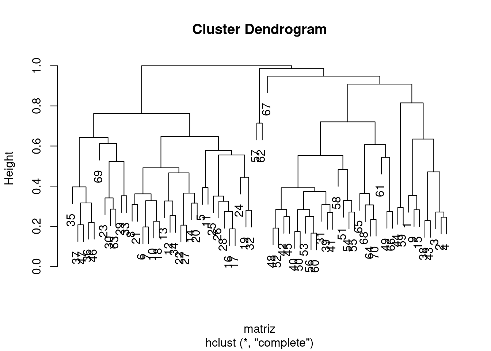
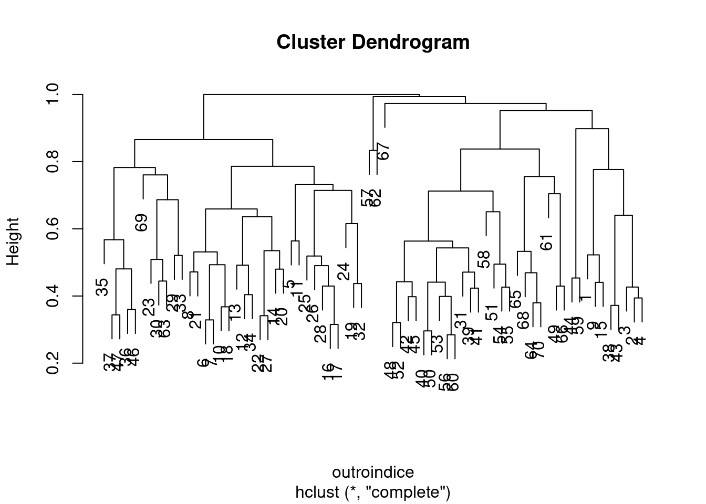
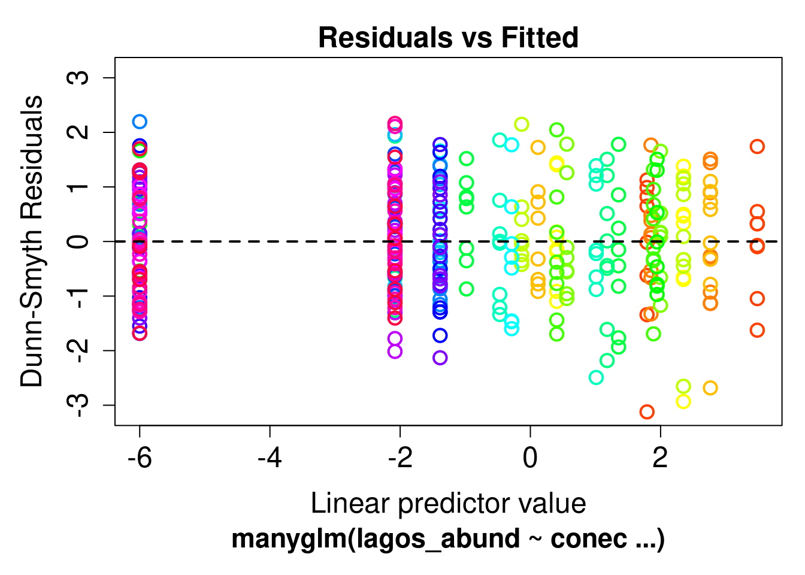
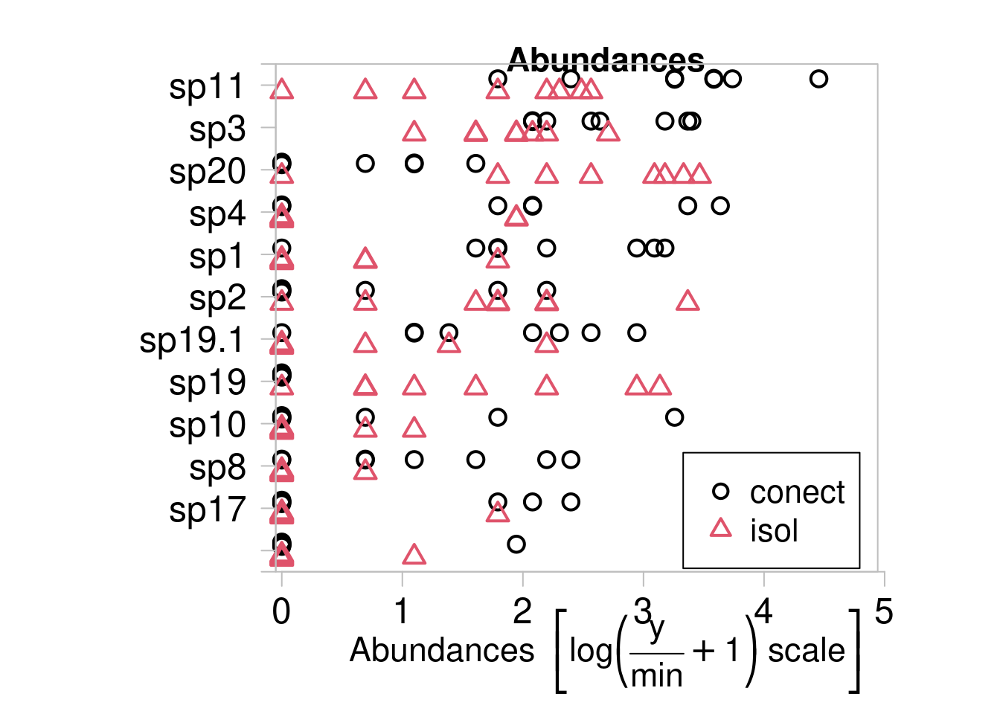
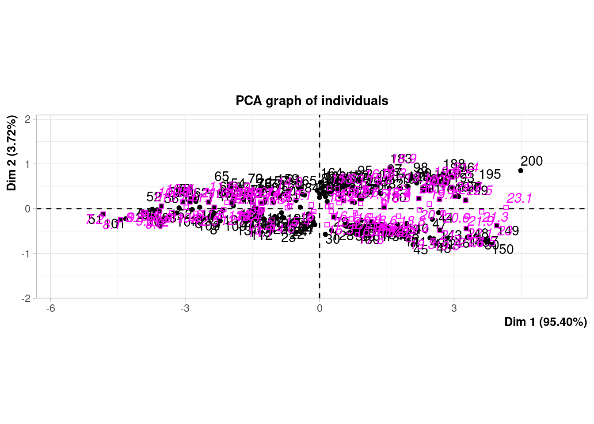

# Cap. 9 - Análises Multivariadas  {-}


```r
# Pacotes necessários
library(vegan)
library(mvabund)
library(MASS)
library(FactoMineR)
library(ecodados)
library(spdep)
library(adespatial)
```

**9.1** Utilize os dados `mite` do pacote `vegan` para testar o efeito de variáveis ambientais sobre a composição de espécies de ácaros utilizando as seguintes análises: RDA, RDAp (combinada com MEM), dbRDA e PERMANOVA. Após realizar as cinco análises, responda às seguintes perguntas?

A) Quais são as variáveis ambientais (mite.env) mais importantes para a composição de ácaros em cada uma das análises? 
B) Os vetores espaciais obtidos com a análise MEM explicam a variação na composição de espécies? Eles são mais ou menos importantes do que as variáveis ambientais?
C) Discuta as diferenças de interpretação entre a RDA, RDAp, dbRDA e PERMANOVA.

Dados necessários:


```r
data(mite)
data(mite.env)
data(mite.xy)
```

Solução:


```r
# Matriz padronizada - Hellinger
species.hel <- decostand(x = mite, method = "hellinger")
# verificar se algum local está sem nenhuma espécie
sum(rowSums(species.hel)==0) 
#> [1] 0

# verificar se algum espécie não está em nenhuma localidade
sum(colSums(species.hel)==0) 
#> [1] 0

# RDA
#*******************************************************

## RDA com dados ambientais
rda.mite <- rda(species.hel ~ ., data = mite.env)
res.axis <- anova.cca(rda.mite, by = "axis") 
res.var <- anova.cca(rda.mite, by = "term") 
res.axis
#> Permutation test for rda under reduced model
#> Forward tests for axes
#> Permutation: free
#> Number of permutations: 999
#> 
#> Model: rda(formula = species.hel ~ SubsDens + WatrCont + Substrate + Shrub + Topo, data = mite.env)
#>          Df Variance       F Pr(>F)    
#> RDA1      1 0.137314 42.6606  0.001 ***
#> RDA2      1 0.024663  7.6624  0.001 ***
#> RDA3      1 0.013824  4.2949  0.048 *  
#> RDA4      1 0.011180  3.4734  0.129    
#> RDA5      1 0.008297  2.5776  0.374    
#> RDA6      1 0.005485  1.7040  0.840    
#> RDA7      1 0.002106  0.6544  1.000    
#> RDA8      1 0.001893  0.5881  1.000    
#> RDA9      1 0.001272  0.3952  1.000    
#> RDA10     1 0.000983  0.3055  1.000    
#> RDA11     1 0.000570  0.1770  1.000    
#> Residual 58 0.186688                   
#> ---
#> Signif. codes:  
#> 0 '***' 0.001 '**' 0.01 '*' 0.05 '.' 0.1 ' ' 1
res.var
#> Permutation test for rda under reduced model
#> Terms added sequentially (first to last)
#> Permutation: free
#> Number of permutations: 999
#> 
#> Model: rda(formula = species.hel ~ SubsDens + WatrCont + Substrate + Shrub + Topo, data = mite.env)
#>           Df Variance       F Pr(>F)    
#> SubsDens   1 0.015943  4.9531  0.004 ** 
#> WatrCont   1 0.112894 35.0738  0.001 ***
#> Substrate  6 0.040068  2.0747  0.002 ** 
#> Shrub      2 0.019781  3.0728  0.002 ** 
#> Topo       1 0.018902  5.8725  0.001 ***
#> Residual  58 0.186688                   
#> ---
#> Signif. codes:  
#> 0 '***' 0.001 '**' 0.01 '*' 0.05 '.' 0.1 ' ' 1

# dbRDA
#*******************************************************
dbrda.mite <- capscale(species.hel ~ ., 
                       data = mite.env, dist="bray")

dbrda.axis <- anova.cca(dbrda.mite, by = "axis") 
dbrda.var <- anova.cca(dbrda.mite, by = "term") 
dbrda.axis
#> Permutation test for capscale under reduced model
#> Forward tests for axes
#> Permutation: free
#> Number of permutations: 999
#> 
#> Model: capscale(formula = species.hel ~ SubsDens + WatrCont + Substrate + Shrub + Topo, data = mite.env, distance = "bray")
#>          Df SumOfSqs       F Pr(>F)    
#> CAP1      1   4.1328 43.3801  0.001 ***
#> CAP2      1   0.7100  7.4528  0.001 ***
#> CAP3      1   0.3723  3.9080  0.028 *  
#> CAP4      1   0.2420  2.5403  0.294    
#> CAP5      1   0.1899  1.9930  0.617    
#> CAP6      1   0.1531  1.6069  0.822    
#> CAP7      1   0.0762  0.7998  1.000    
#> CAP8      1   0.0640  0.6713  1.000    
#> CAP9      1   0.0432  0.4535  1.000    
#> CAP10     1   0.0378  0.3971  1.000    
#> CAP11     1   0.0329  0.3449  0.998    
#> Residual 58   5.5257                   
#> ---
#> Signif. codes:  
#> 0 '***' 0.001 '**' 0.01 '*' 0.05 '.' 0.1 ' ' 1
dbrda.var
#> Permutation test for capscale under reduced model
#> Terms added sequentially (first to last)
#> Permutation: free
#> Number of permutations: 999
#> 
#> Model: capscale(formula = species.hel ~ SubsDens + WatrCont + Substrate + Shrub + Topo, data = mite.env, distance = "bray")
#>           Df SumOfSqs       F Pr(>F)    
#> SubsDens   1   0.4291  4.5041  0.002 ** 
#> WatrCont   1   3.4806 36.5343  0.001 ***
#> Substrate  6   1.0988  1.9222  0.007 ** 
#> Shrub      2   0.5494  2.8835  0.006 ** 
#> Topo       1   0.4963  5.2091  0.001 ***
#> Residual  58   5.5257                   
#> ---
#> Signif. codes:  
#> 0 '***' 0.001 '**' 0.01 '*' 0.05 '.' 0.1 ' ' 1

# PERMANOVA
#*******************************************************
species.dis <- vegdist(species.hel, "bray")

permanova.mite <- adonis(species.hel~., data = mite.env, method = "bray")
permanova.mite
#> 
#> Call:
#> adonis(formula = species.hel ~ ., data = mite.env, method = "bray") 
#> 
#> Permutation: free
#> Number of permutations: 999
#> 
#> Terms added sequentially (first to last)
#> 
#>           Df SumsOfSqs MeanSqs F.Model      R2 Pr(>F)    
#> SubsDens   1    0.4017  0.4017   5.696 0.04059  0.001 ***
#> WatrCont   1    3.4749  3.4749  49.278 0.35117  0.001 ***
#> Substrate  6    0.9460  0.1577   2.236 0.09561  0.001 ***
#> Shrub      2    0.5100  0.2550   3.616 0.05154  0.002 ** 
#> Topo       1    0.4726  0.4726   6.701 0.04776  0.003 ** 
#> Residuals 58    4.0899  0.0705         0.41333           
#> Total     69    9.8950                 1.00000           
#> ---
#> Signif. codes:  
#> 0 '***' 0.001 '**' 0.01 '*' 0.05 '.' 0.1 ' ' 1

# RDAp
#*******************************************************
# Gerar vetores espaciais: MEM

mite_knn <- knearneigh(as.matrix(mite.xy), k = 2, longlat = FALSE)
mite_nb <- knn2nb(mite_knn, sym = TRUE)
mite_listw <- nb2listw(mite_nb, style = "W")
mite_MEM <- scores.listw(mite_listw, MEM.autocor = "positive")
mite_candidates <- listw.candidates(mite.xy, nb = c("gab", "mst", "dnear"), 
                               weights = c("binary", "flin"))

W_sel_mite <- listw.select(species.hel, mite_candidates, MEM.autocor = "positive",
                          p.adjust = TRUE, method = "FWD")
#> Procedure stopped (alpha criteria): pvalue for variable 13 is 0.054000 (> 0.050000)
#> Procedure stopped (alpha criteria): pvalue for variable 14 is 0.054000 (> 0.050000)
#> Procedure stopped (alpha criteria): pvalue for variable 14 is 0.069000 (> 0.050000)
#> Procedure stopped (alpha criteria): pvalue for variable 16 is 0.073000 (> 0.050000)
#> Procedure stopped (adjR2thresh criteria) adjR2cum = 0.451035 with 11 variables (> 0.445310)
#> Procedure stopped (alpha criteria): pvalue for variable 12 is 0.052000 (> 0.050000)

mite_sel_MEM <- as.data.frame(W_sel_mite$best$MEM.select)
rownames(mite_sel_MEM) <- rownames(mite.xy) 

mite_pred_vars <- data.frame(mite.env, mite_sel_MEM)

names(mite_sel_MEM)
#>  [1] "MEM4"  "MEM2"  "MEM1"  "MEM9"  "MEM3"  "MEM8"  "MEM31"
#>  [8] "MEM7"  "MEM17" "MEM13" "MEM6"  "MEM5"  "MEM11"
names(mite.env)
#> [1] "SubsDens"  "WatrCont"  "Substrate" "Shrub"    
#> [5] "Topo"
rda.p <- rda(species.hel ~
               SubsDens+WatrCont+Substrate+Shrub+Topo + # Preditores ambientais
               Condition(MEM1 + MEM2 + MEM3 + MEM4), # Preditores espaciais
             data = mite_pred_vars)


rda.p.axis <- anova.cca(rda.p, by = "axis") 
rda.p.var <- anova.cca(rda.p, by = "term") 

rda.p.axis
#> Permutation test for rda under reduced model
#> Forward tests for axes
#> Permutation: free
#> Number of permutations: 999
#> 
#> Model: rda(formula = species.hel ~ SubsDens + WatrCont + Substrate + Shrub + Topo + Condition(MEM1 + MEM2 + MEM3 + MEM4), data = mite_pred_vars)
#>          Df Variance       F Pr(>F)    
#> RDA1      1 0.043419 14.6254  0.001 ***
#> RDA2      1 0.017789  5.9921  0.005 ** 
#> RDA3      1 0.011421  3.8471  0.094 .  
#> RDA4      1 0.008586  2.8920  0.310    
#> RDA5      1 0.006671  2.2472  0.554    
#> RDA6      1 0.002781  0.9366  0.999    
#> RDA7      1 0.002383  0.8026  1.000    
#> RDA8      1 0.001430  0.4816  1.000    
#> RDA9      1 0.001061  0.3574  1.000    
#> RDA10     1 0.000778  0.2619  1.000    
#> RDA11     1 0.000542  0.1825  1.000    
#> Residual 54 0.160312                   
#> ---
#> Signif. codes:  
#> 0 '***' 0.001 '**' 0.01 '*' 0.05 '.' 0.1 ' ' 1
rda.p.var
#> Permutation test for rda under reduced model
#> Terms added sequentially (first to last)
#> Permutation: free
#> Number of permutations: 999
#> 
#> Model: rda(formula = species.hel ~ SubsDens + WatrCont + Substrate + Shrub + Topo + Condition(MEM1 + MEM2 + MEM3 + MEM4), data = mite_pred_vars)
#>           Df Variance       F Pr(>F)    
#> SubsDens   1 0.012981  4.3726  0.001 ***
#> WatrCont   1 0.035825 12.0675  0.001 ***
#> Substrate  6 0.033368  1.8733  0.003 ** 
#> Shrub      2 0.010736  1.8082  0.025 *  
#> Topo       1 0.003949  1.3301  0.177    
#> Residual  54 0.160312                   
#> ---
#> Signif. codes:  
#> 0 '***' 0.001 '**' 0.01 '*' 0.05 '.' 0.1 ' ' 1
```

**Respostas**

**A) Quais são as variáveis ambientais (mite.env) mais importantes para a composição de ácaros em cada uma das análises?**

RDA simples -> todas as variáveis afetaram a composição de espécies, mas a variável WatrCont foi a mais importante (F = 35,07)
dbRDA -> todas as variáveis afetaram a composição de espécies, mas a variável WatrCont foi a mais importante (F = 36,53)
PERMANOVA -> todas as variáveis afetaram a composição de espécies, mas a variável WatrCont foi a mais importante (F = 35,51)
RDAp -> todas as variáveis afetaram a composição de espécies, mas a variável WatrCont foi a mais importante (F = 35,51). Porém, é importante ressaltar que o efeito é bem menor quando incluimos os vetores espaciais.

**B) Os vetores espaciais obtidos com a análise MEM explicam a variação na composição de espécies? Eles são mais ou menos importantes do que as variáveis ambientais?**

Os vetores espaciais possuem efeito sobre a composição de ácaros, especialmente os MEMs 4, 2, 9, 1, 3, 6, 7, 13 e 31.
A partição de variância indica que o valor espacial "puro" é mais importante do que o ambiental "puro". Porém, a variação ambiental espacialmente estruturada tem maior poder de explicação.

**C) Discuta as diferenças de interpretação entre a RDA, RDAp, dbRDA e PERMANOVA.**

As análises que não incluem o componente espacial (RDA, dbRDA e PERMANOVA) enfatizam a relevância das variáveis ambientais e não foram capazes de identificar que parte da explicação atribuída à variação ambiental é, de fato, explicada pela estrutura espacial nas variáveis ambientais e na composição de espécies

**9.2** Efetue uma análise de agrupamento pela função `hclust()`. Lembre-se de dar nome ao objeto para poder plotar o dendrograma depois. Utilize a ajuda para encontrar como entrar com os argumentos da função. 

A) utilizando o método UPGMA e o índice de Bray-Curtis. 
B) Faça agora o dendrograma com outro índice de dissimilaridade e compare os resultados. São diferentes? No que eles influenciaríam a interpretação do resultado?

Solução: 


```r
##trans. numa matriz de dissimilaridade
matriz<-vegdist(mite, method="bray")

matriz1<-hclust(matriz, method="complete")
plot(matriz1)
```



```r

##transforma a matriz com outro índice
outroindice<-vegdist(mite, method="jaccard")
outro<-hclust(outroindice, method="complete")
plot(outro)
```



**9.3** Na perspectiva de metacomunidades (Leibold et al., 2004), a dispersão dos organismos tem um papel proeminente para entender como as espécies estão distribuídas na natureza. Com o objetivo de testar se a dispersão influencia a composição de espécies de cladóceros e copépodos, e portanto a estrutura da metacomunidade, um pesquisador selecionou dois conjuntos de lagos: em um deles todos os lagos são isolados e no outro os lagos são conectados. 

A) Importe o conjunto de dados lagos do pacote `ecodados` e responda a pergunta se o fato de os lagos estarem conectados ou não influencia a composição de espécies desses microcrustáceos. Utilize métodos baseados em modelos que você aprendeu ao longo do capítulo para modelar a abundância multivariada.

B) Faça um plot mostrando a abundância relativa das espécies com maior abundância e veja se elas são diferentes entre os tipos lagos. Combine este resultado com o do item anterior para interpretar o resultado final.

Solução: 


```r
#A) 
head(ecodados::lagos)
#>         sp1 sp2 sp3 sp4 sp5 sp6 sp7 sp8 sp9 sp10 sp11 sp12
#> conect1   5   0   8   5   1   1   0   1   0    5   35    0
#> conect2   4   0  12  37   0   0   0   2   0    0   25    0
#> conect3   8   0  13   0   0   0   0   8   0    0   85    0
#> conect4  21   0  28  28   0   0   0   4   0    0   35    0
#> conect5  23   0  29   0   0   0   0   1   0    1   41    0
#> conect6   0   1   7   7   0   0   0  10   0   25   25    0
#>         sp13 sp14 sp15 sp16 sp17 sp18 sp19 sp19.1 sp20 sp21
#> conect1    0    0    0    0    5    0    0      2    0    0
#> conect2    0    0    0    0    0    0    0      2    1    0
#> conect3    0    0    0    0    0    0    0      3    2    0
#> conect4    1    0    0    0    0    0    0      7    0    1
#> conect5    0    0    0    1    7    0    0      9    4    0
#> conect6    0    0    0    0    0    0    0     12    0    0
#>         sp22
#> conect1    0
#> conect2    0
#> conect3    0
#> conect4    0
#> conect5    0
#> conect6    0

conec=factor(c(rep(1,8), rep(2,8)),labels=c("conect","isol"))

lagos_abund <- mvabund(lagos)
modelo1 <- manyglm(lagos_abund~conec)
plot(modelo1)
```



```r
summary(modelo1)
#> 
#> Test statistics:
#>             wald value Pr(>wald)    
#> (Intercept)     22.808     0.001 ***
#> conecisol        9.579     0.001 ***
#> --- 
#> Signif. codes:  0 '***' 0.001 '**' 0.01 '*' 0.05 '.' 0.1 ' ' 1 
#> 
#> Test statistic:  9.579, p-value: 0.001 
#> Arguments:
#>  Test statistics calculated assuming response assumed to be uncorrelated 
#>  P-value calculated using 999 resampling iterations via pit.trap resampling (to account for correlation in testing).

#B)
plot(lagos_abund, conec)
#> 
#>  PIPING TO 1st MVFACTOR
```



**9.4** Carregue o pacote `MASS` para utilizar os dados `crabs`. Este conjunto traz medidas morfológicas de dois morfo-tipos da espécie de carangueijo *Leptograpsus variegatus* coletada em Fremantle, Austrália. Calcule uma PCA e veja se existe uma semelhança morfológica entre os dois morfo-tipos. Lembre-se de dar nome
ao objeto e use a função `biplot()` para plotar o resultado do teste. Dica: a projeção de um objeto perpendicular à seta do descritor fornece a posição aproximada do objeto ao longo desse descritor. A distância dos objetos no espaço cartesiano reflete a distância euclidiana entre eles.

Solução:


```r
data(crabs)
head(crabs)
#>   sp sex index   FL  RW   CL   CW  BD
#> 1  B   M     1  8.1 6.7 16.1 19.0 7.0
#> 2  B   M     2  8.8 7.7 18.1 20.8 7.4
#> 3  B   M     3  9.2 7.8 19.0 22.4 7.7
#> 4  B   M     4  9.6 7.9 20.1 23.1 8.2
#> 5  B   M     5  9.8 8.0 20.3 23.0 8.2
#> 6  B   M     6 10.8 9.0 23.0 26.5 9.8

pca_crabs <- PCA(crabs[,4:8], quali.sup = 1, graph = FALSE)
plot(pca_crabs)
```


