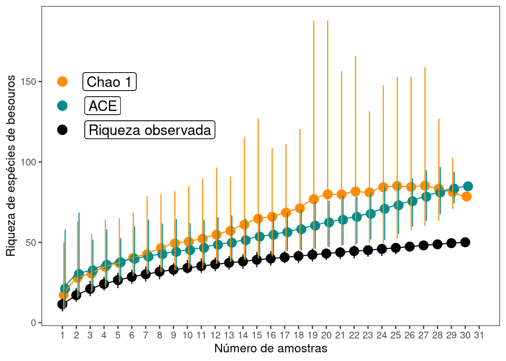
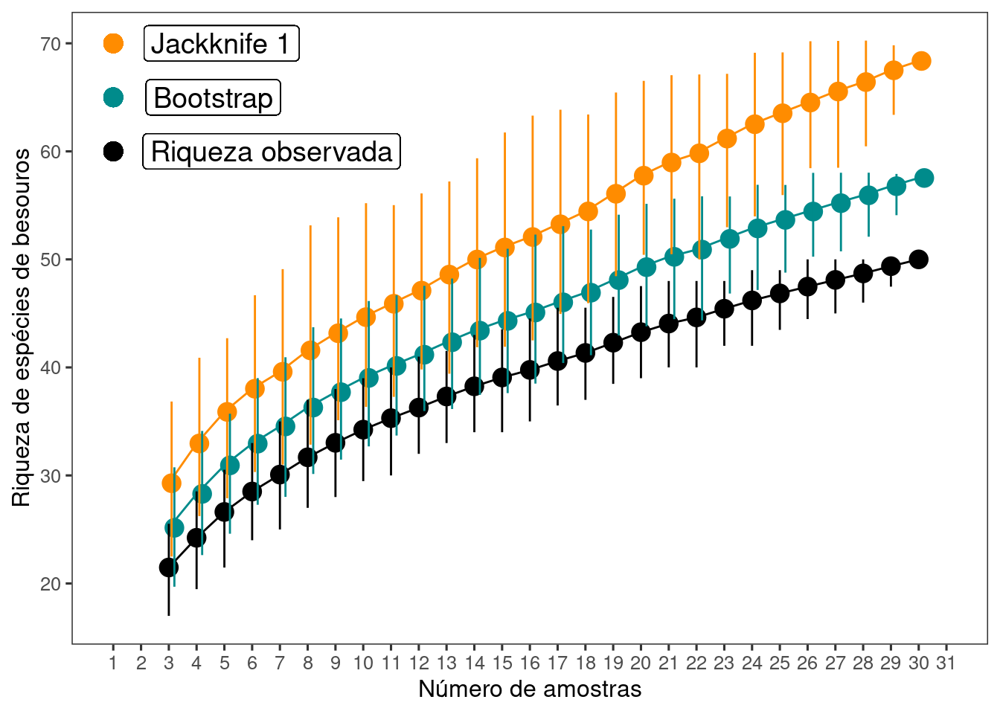

# Cap. 11 - Estimadores de riqueza {-}


```r
# Pacotes necessários
library(iNEXT)
library(ecodados)
library(ggplot2)
library(vegan)
library(nlme)
library(dplyr)
```

**11.1**
Carregue os dados - Cap11_exercicio1 - que está no pacote ecodados. Este conjunto de dados representa a abundância de 50 espécies de besouros coletados em 30 amostras. Calcule os estimadores de riqueza - Chao1 e ACE - e faça um gráfico contendo a riqueza observada e os dois estimadores de riqueza. Qual a sua interpretação sobre o esforço amostral?

Solução:


```r
# Carregar a planilha com os dados
exercicio_1 <- ecodados::Cap11_exercicio1

# estimadores abundância
est_abun <- estaccumR(exercicio_1, permutations = 100)

## Preparando os dados para fazer o gráfico
resultados_abun <- summary(est_abun 
                          , display = c("S", "chao", "ace"))
res_abun <- cbind(resultados_abun$chao[, 1:4], resultados_abun$ace[, 2:4], 
                 resultados_abun$S[, 2:4])
res_abun <- as.data.frame(res_abun)
colnames(res_abun) <- c("Amostras", "Chao", "C_inferior", "C_superior", 
                       "ace", "A_inferior", "A_superior",
                        "Riqueza", "R_inferior", "R_superior")


## Gráfico
ggplot(res_abun, aes(y = Riqueza, x = Amostras)) +
    geom_point(aes(y = Chao, x = Amostras + 0.1), size = 4, 
               color = "darkorange", alpha = 1) +
    geom_point(aes(y = ace, x = Amostras + 0.2), size = 4, 
               color = "cyan4", alpha = 1) +
    geom_point(aes(y = Riqueza, x = Amostras), size = 4, 
               color = "black", alpha = 1) +
    geom_point(y = 150, x = 1, size = 4, color = "darkorange", alpha = 1) + 
    geom_point(y = 135, x = 1, size = 4, color = "cyan4", alpha = 1) + 
    geom_point(y = 120, x = 1, size = 4, color = "black", alpha = 1) +
    geom_label(y = 150, x = 4.4, label = "Chao 1", size = 5) +
    geom_label(y = 135, x = 3.9, label = "ACE", size = 5) +
    geom_label(y = 120, x = 7.3, label = "Riqueza observada", size = 5) + 
    geom_line(aes(y = Chao, x = Amostras), color = "darkorange") +
    geom_line(aes(y = ace, x = Amostras), color = "cyan4") +
    geom_line(aes(y = Riqueza, x = Amostras), color = "black") +
    geom_linerange(aes(ymin = C_inferior, ymax = C_superior,
                       x = Amostras + 0.1), color = "darkorange") +
    geom_linerange(aes(ymin = A_inferior, ymax = A_superior,
                       x = Amostras + 0.2), color = "cyan4") +
    geom_linerange(aes(ymin = R_inferior, ymax = R_superior,
                       x = Amostras), color = "black") +
    scale_x_continuous(limits = c(1, 31), breaks = seq(1, 31, 1)) +
    labs (x = "Número de amostras", y = "Riqueza de espécies de besouros") +
    theme_bw(base_size = 12) +
    theme(panel.grid.major = element_blank(), panel.grid.minor = element_blank())
```



**11.2**

Utilize o mesmo conjunto de dados do exercício anterior. Calcule os estimadores de riqueza - Jackknife 1 e bootstrap. Faça um gráfico contendo a riqueza observada e os dois estimadores de riqueza. Qual a sua interpretação sobre o esforço amostral? Compare com os resultados do exercício anterior que utilizam estimadores baseados na abundância das espécies. 

Solução:


```r
# Carregar a planilha com os dados
exercicio_1 <- ecodados::Cap11_exercicio1

# estimadores incidencia
est_inc <- poolaccum(exercicio_1, permutations = 100)

## Preparando os dados para fazer o gráfico
resultados_inc <- summary(est_inc 
                          , display = c("S", "jack1", "boot"))
res_inc <- cbind(resultados_inc$jack1[, 1:4], resultados_inc$boot[, 2:4], 
                 resultados_inc$S[, 2:4])
res_inc <- as.data.frame(res_inc)
colnames(res_inc) <- c("Amostras", "jack1", "j_inferior", "j_superior", 
                       "boot", "B_inferior", "B_superior",
                        "Riqueza", "R_inferior", "R_superior")


## Gráfico
ggplot(res_inc, aes(y = Riqueza, x = Amostras)) +
    geom_point(aes(y = jack1, x = Amostras + 0.1), size = 4, 
               color = "darkorange", alpha = 1) +
    geom_point(aes(y = boot, x = Amostras + 0.2), size = 4, 
               color = "cyan4", alpha = 1) +
    geom_point(aes(y = Riqueza, x = Amostras), size = 4, 
               color = "black", alpha = 1) +
    geom_point(y = 70, x = 1, size = 4, color = "darkorange", alpha = 1) + 
    geom_point(y = 65, x = 1, size = 4, color = "cyan4", alpha = 1) + 
    geom_point(y = 60, x = 1, size = 4, color = "black", alpha = 1) +
    geom_label(y = 70, x = 4.9, label = "Jackknife 1", size = 5) +
    geom_label(y = 65, x = 4.6, label = "Bootstrap", size = 5) +
    geom_label(y = 60, x = 6.7, label = "Riqueza observada", size = 5) + 
    geom_line(aes(y = jack1, x = Amostras), color = "darkorange") +
    geom_line(aes(y = boot, x = Amostras), color = "cyan4") +
    geom_line(aes(y = Riqueza, x = Amostras), color = "black") +
    geom_linerange(aes(ymin = j_inferior, ymax = j_superior,
                       x = Amostras + 0.1), color = "darkorange") +
    geom_linerange(aes(ymin = B_inferior, ymax = B_superior,
                       x = Amostras + 0.2), color = "cyan4") +
    geom_linerange(aes(ymin = R_inferior, ymax = R_superior,
                       x = Amostras), color = "black") +
    scale_x_continuous(limits = c(1, 31), breaks = seq(1, 31, 1)) +
    labs (x = "Número de amostras", y = "Riqueza de espécies de besouros") +
    theme_bw(base_size = 12) +
    theme(panel.grid.major = element_blank(), panel.grid.minor = element_blank())
```



**11.3**
Vamos refazer o exercício 10 do Capítulo 7 que usa Generalized Least Squares (GLS) para testar a relação da riqueza de anuros em 44 localidades na Mata Atlântica com a precipitação anual. Contudo, ao invés de considerar a riqueza de espécies de anuros observada como variável resposta, iremos utilizar a riqueza extrapolada. Utilize os dados "anuros_composicao" para estimar a riqueza extrapolada e o dados "anuros_ambientais" para acessar os dados de precipitação anual e coordenadas geográficas. Qual a sua interpretação dos resultados utilizando a riqueza observada e extrapolada? 

Solução:

```r
# Carregar a planilha com os dados
exercicio_3 <- ecodados::anuros_composicao

# Verificar a comunidade com maior abundãncia. 
abund_max <- max(colSums(exercicio_3))

# Calcular a riqueza extrapolada de espécies para todas as comunidades 
# considerando a maior abundância. 
resultados_extrapolacao <- iNEXT(exercicio_3, q = 0, 
                                 datatype = "abundance", 
                                 endpoint = abund_max)

# Loop para determinar a riqueza extrapolada para as 44 localidades
resultados_comunidades_ext <- data.frame()
riqueza_extrapolada <- c()

for (i in 1:44){
    resultados_comunidades_ext <- data.frame(resultados_extrapolacao$iNextEst[i])
    riqueza_extrapolada[i] <- resultados_comunidades_ext[40, 4] 
}


# carregando o data frame com todas as variáveis
exercicio_3_1 <- ecodados::anuros_ambientais

# Criando um data frame com a riqueza extrapolada, precipitação anual,
# latitude e longitude
dados_combinado_ext <- data.frame(riqueza_extrapolada, exercicio_3_1[,c(3,5,6)])


## Modelo gls sem estrutura espacial
no_spat_gls <- gls(riqueza_extrapolada ~ Prec_anual, dados_combinado_ext, method = "REML")

## Covariância esférica
espher_model <- gls(riqueza_extrapolada ~ Prec_anual, dados_combinado_ext, 
                    corSpher(form = ~Latitude + Longitude, nugget = TRUE))

## Covariância exponencial
expon_model <- gls(riqueza_extrapolada ~ Prec_anual, dados_combinado_ext, 
                   corExp(form = ~Latitude + Longitude, nugget = TRUE))

## Covariância Gaussiana
gauss_model <- gls(riqueza_extrapolada ~ Prec_anual, dados_combinado_ext, 
                   corGaus(form = ~Latitude + Longitude, nugget = TRUE))

## Covariância linear
cor_linear_model <- gls(riqueza_extrapolada ~ Prec_anual, dados_combinado_ext, 
                        corLin(form = ~Latitude + Longitude, nugget = TRUE),
                        control = glsControl(opt='optim',  msVerbose = F))

## Covariância razão quadrática
ratio_model <- gls(riqueza_extrapolada ~ Prec_anual, dados_combinado_ext, 
                   corRatio(form = ~Latitude + Longitude, nugget = TRUE))

## Seleção de modelos
aic_fit <- AIC(no_spat_gls, espher_model, cor_linear_model, expon_model, 
               gauss_model,ratio_model)
aic_fit %>% arrange(AIC)
#>                  df      AIC
#> no_spat_gls       3 338.8380
#> gauss_model       5 339.6672
#> ratio_model       5 339.6853
#> expon_model       5 340.3431
#> espher_model      5 342.8380
#> cor_linear_model  5 342.8489


## Gráfico
plot(residuals(espher_model, type = "normalized") ~ fitted(espher_model))
```


```r

## Varigrama
espher_model_variog <- Variogram(espher_model, form = ~Latitude + Longitude,
                               resType = "normalized")

plot(espher_model_variog, main = "Variograma com o modelo de Covariância Esférica")
```


```r

## Resumo dos modelos
summary(espher_model)$tTable 
#>                 Value   Std.Error   t-value     p-value
#> (Intercept) 3.7004741 8.319750795 0.4447818 0.658761200
#> Prec_anual  0.0173344 0.005831002 2.9727995 0.004869827
summary(no_spat_gls)$tTable
#>                 Value   Std.Error   t-value     p-value
#> (Intercept) 3.7004741 8.319750757 0.4447818 0.658761200
#> Prec_anual  0.0173344 0.005831002 2.9727995 0.004869827
```
