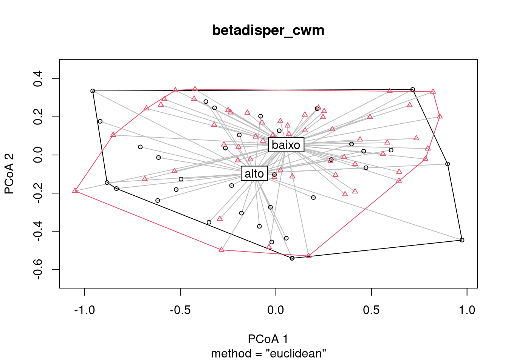

# Cap. 14 - Diversidade Funcional {-}

**14.1**
Utilize os dados “aviurba” do pacote ade4 para testar o efeito de variáveis ambientais na dispersão (FDis) e regularidade funcional (FEve). Utilize modelos lineares (lm) para testar quais variáveis ambientais são as mais importantes para a dispersão e regularidade funcional. Além disso, faça um boxplot comparando os valores de FDis e FEve entre as categorias das variáveis ambientais mais relevantes. 


Solução:

```r

# Pacotes e dados
library(ade4)
library(FD)
library(ggplot2)
library(tidyverse)
library(ecodados)
library(gridExtra)
data(aviurba)
com <- aviurba$fau # matriz de composição de espécies 
trait <- aviurba$traits # atributos funcionais das espécies
amb <- aviurba$mil # matriz de variáveis ambientais

# 1. Cálculo da diversidade funcional: FDis e FEve

div_fun <- dbFD(trait, com)
#> Species x species distance matrix was not Euclidean. 'sqrt' correction was applied. 
#> FRic: Only categorical and/or ordinal trait(s) present in 'x'. FRic was measured as the number of unique trait combinations, NOT as the convex hull volume. 
#> FDiv: Cannot be computed when only categorical and/or ordinal trait(s) present in 'x'.

FDis <- div_fun$FDis
FEve <- div_fun$FEve


#. 2. modelos lineares

lm_fdis <- lm(FDis~., data=amb)
anova(lm_fdis)
#> Analysis of Variance Table
#> 
#> Response: FDis
#>           Df   Sum Sq   Mean Sq F value  Pr(>F)  
#> farms      1 0.008631 0.0086311  3.1698 0.08422 .
#> small.bui  1 0.000000 0.0000000  0.0000 0.99665  
#> high.bui   1 0.001561 0.0015610  0.5733 0.45434  
#> industry   1 0.012983 0.0129830  4.7680 0.03621 *
#> fields     1 0.004193 0.0041926  1.5397 0.22341  
#> grassland  1 0.000053 0.0000528  0.0194 0.89007  
#> scrubby    1 0.000773 0.0007733  0.2840 0.59767  
#> deciduous  1 0.000385 0.0003845  0.1412 0.70948  
#> conifer    1 0.000191 0.0001905  0.0700 0.79304  
#> noisy      1 0.000386 0.0003859  0.1417 0.70900  
#> veg.cover  7 0.020059 0.0028655  1.0524 0.41507  
#> Residuals 33 0.089857 0.0027230                  
#> ---
#> Signif. codes:  
#> 0 '***' 0.001 '**' 0.01 '*' 0.05 '.' 0.1 ' ' 1

lm_feve <- lm(FEve~., data=amb)
anova(lm_feve)
#> Analysis of Variance Table
#> 
#> Response: FEve
#>           Df  Sum Sq  Mean Sq F value   Pr(>F)   
#> farms      1 0.00001 0.000007  0.0005 0.981844   
#> small.bui  1 0.14651 0.146507 10.7662 0.002446 **
#> high.bui   1 0.00969 0.009687  0.7118 0.404906   
#> industry   1 0.00786 0.007860  0.5776 0.452664   
#> fields     1 0.03908 0.039083  2.8720 0.099549 . 
#> grassland  1 0.00769 0.007686  0.5648 0.457668   
#> scrubby    1 0.02200 0.021996  1.6164 0.212489   
#> deciduous  1 0.00010 0.000104  0.0076 0.930976   
#> conifer    1 0.00192 0.001921  0.1412 0.709495   
#> noisy      1 0.04924 0.049236  3.6181 0.065911 . 
#> veg.cover  7 0.14969 0.021385  1.5715 0.178578   
#> Residuals 33 0.44907 0.013608                    
#> ---
#> Signif. codes:  
#> 0 '***' 0.001 '**' 0.01 '*' 0.05 '.' 0.1 ' ' 1


# 3. Para facilitar a construção dos gráficos, podemos criar um data.frame

dat_graf <- data.frame(amb, FDis, FEve)

# 4. Gráficos

dat_graf %>% 
  ggplot(aes(x = industry, y = FDis, fill = industry)) +
  geom_boxplot(width = 0.4, alpha = 0.7)+
  scale_fill_manual(values = c("cyan4", "darkorange"))+
  labs(x = "Presença de indústrias", y = "Divergência Funcional (FDis)") +
  tema_livro() -> g_fdis

dat_graf %>% 
  ggplot(aes(x = small.bui, y = FDis, fill = small.bui)) +
  geom_boxplot(width = 0.4, alpha = 0.7)+
  scale_fill_manual(values = c("cyan4", "darkorange"))+
  labs(x = "Presença de pequenas construções", y = "Regularidade Funcional (FEve)") +
  tema_livro() -> g_feve

grid.arrange(g_fdis, g_feve, nrow = 1)
```


**14.2**
Utilize os dados “mafragh” do pacote ade4 para teste o efeito da das variáveis “conductivity”, “silt” e “K2O” na diversidade funcional (método de Petchey e Gaston). Utilize modelos lineares (regressão múltipla) para testar a relação entre essas variáveis e discuta (a) qual variável mais importante (se houver) e (b) se as conclusões são coerentes tendo como base os pressupostos dos modelos lineares. Além disso, caso exista alguma relação significativa, faça um gráfico (scatterplot) da relação da variável mais importante e a diversidade funcional.

Solução:

```r

# Pacotes e dados
library(ade4)
library(vegan)
library(ape)
library(picante)
library(ggplot2)
library(tidyverse)
library(ecodados)


data(mafragh)
trait_ma <- mafragh$traits$tabQuantitative  # atributos funcionais das espécies
amb_ma <- mafragh$env # matriz de variáveis ambientais
com_ma <- mafragh$flo # matriz de composição de espécies
names(com_ma) <- rownames(trait_ma)

# 1. Cálculo da distância funcional

dis <- vegdist(trait_ma, "euclidean")
  
# 2. Construção do dendrograma  

dendro_ma <- hclust(dis, "average")

# 3. Transformar dendrograma em classe phylo  

tree_ma<- as.phylo(dendro_ma)

# 4. Diversidade Funcional de Petchey & Gaston

FD_ma <- pd(com_ma, tree_ma)$PD

#. 5. modelo linear

lm_FD <- lm(FD_ma~Conductivity+`K+`+Silt+K2O, data=amb_ma)
par(mfrow = c(2, 2), oma = c(0, 0, 2, 0))
plot(lm_FD)
```


```r

anova(lm_FD) # resultados
#> Analysis of Variance Table
#> 
#> Response: FD_ma
#>              Df  Sum Sq Mean Sq F value   Pr(>F)    
#> Conductivity  1   2.104   2.104  1.4431   0.2327    
#> `K+`          1  35.301  35.301 24.2172 3.76e-06 ***
#> Silt          1   0.232   0.232  0.1592   0.6909    
#> K2O           1   0.015   0.015  0.0104   0.9189    
#> Residuals    92 134.108   1.458                     
#> ---
#> Signif. codes:  
#> 0 '***' 0.001 '**' 0.01 '*' 0.05 '.' 0.1 ' ' 1

# 6. Para facilitar a construção dos gráficos, adicionar FD no data.frame amb_ma

amb_ma$FD <- FD_ma

# 7. Gráfico

amb_ma %>% 
  ggplot(aes(x = `K+`, y = FD_ma)) +
  geom_point(pch = 21, color = "black", fill = "cyan4", size = 3)+
  geom_smooth(method = "lm", color = "black") +
  labs(x = "Quantidade de K+", y = "Diversidade Funcional (FD)") +
  tema_livro() 
```


**14.3** Utilize os dados “mafragh” do pacote ade4 para comparar a composição filogenética e funcional em áreas com alta e baixa concentração de potássio. Para fazer esta comparação, será necessário transformar a matriz de atributos funcionais e a árvore filogenética em matrizes de distância e, depois, utilizar o CWM para criar uma matriz de localidades por composição funcional ou filogenética. Depois, você poderá usar a matriz CWM para testar potenciais diferenças entre concentrações com PERMANOVA e para visualizar com PCoA.

Solução:

```r

# Pacotes e dados
library(ade4)
library(FD)
library(vegan)
library(ggplot2)
library(tidyverse)
library(ecodados)


data(mafragh)
trait_ma <- mafragh$traits$tabQuantitative  # atributos funcionais das espécies
amb_ma <- mafragh$env # matriz de variáveis ambientais
com_ma <- mafragh$flo # matriz de composição de espécies
names(com_ma) <- rownames(trait_ma)

# 1. CWM: Cálculo da composição funcional

cwm_fun <-  dbFD(trait_ma, com_ma)$CWM 
#> FEVe: Could not be calculated for communities with <3 functionally singular species. 
#> FDis: Equals 0 in communities with only one functionally singular species. 
#> FRic: To respect s > t, FRic could not be calculated for communities with <3 functionally singular species. 
#> FRic: Dimensionality reduction was required. The last PCoA axis (out of 3 in total) was removed. 
#> FRic: Quality of the reduced-space representation = 0.8976601 
#> FDiv: Could not be calculated for communities with <3 functionally singular species.

# 2. criar uma variável categórica a partir da quantidade de K+

amb_ma$k_cat <- ifelse(amb_ma$`K+` > mean(amb_ma$`K+`), "alto", "baixo")

# 2. PERMANOVA

permanova_cwm <- adonis(cwm_fun ~ k_cat, data = amb_ma)

dis_cwm <- vegdist(cwm_fun, "euclidean")

# 3. Betadisper + gráfico PCoA

betadisper_cwm <- betadisper(dis_cwm, amb_ma$k_cat)
plot(betadisper_cwm)
```



